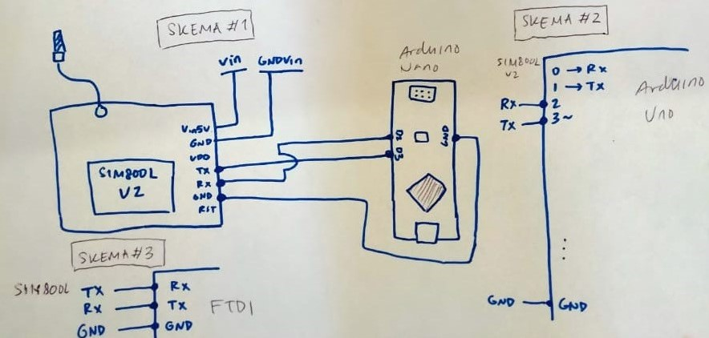
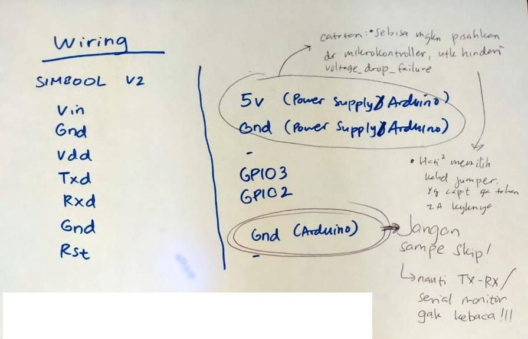

# GSM Send-Recieve SMS Messages :mailbox_with_mail:

This project can be used to send sms messages with the SIM800L V2 module (not the SIM800L V1, nor any other type of module guaranteed to succeed).

## How To:
### Preparation:

- Install Arduino IDE, or any IDE that can compile with the Arduino Framework

### SIM800L V2 Wiring/Cabling (Follow the schematic):
- Connect SIM800 GND PIN with power source 
> if possible, differ power source with microcontroller. If use microcontroller as power source, e.g: arduino; sometimes cause failure, or voltage drop. Causing SIM800 module to restart endlessly.
- Connect SIM800 TX PIN with GPIO3 (Arduino Uno and others) or D3 (Arduino Nano) or RX PIN (FTDI/CH340)
- Connect SIM800 RX PIN with GPIO2 (Arduino Uno and others) or D2 (Arduino Nano) or TX PIN (FTDI/CH340)
- Connect SIM800 GND PIN with GND of microcontroller/USB to TTL Serial
- Connect SIM800 Vin5v with proper 5v power source 
> if possible, differ power source with microcontroller. If use microcontroller as power source, e.g: arduino; sometimes cause failure, or voltage drop. Causing SIM800 module to restart endlessly.

> Plug the 5v LAST, to not damage the SIM800 module

- Wait until LED blinks at 1s interval
- Wait until LED blinks at 3s interval
- Module SIM800 is ready to use

Below is Full Schematic



### Program it!:

1. Create **credentials.h**, save within the same folder. **credentials.h** copy this inside, and change the number inside `dest_phone_no[16]`:
```
char dest_phone_no[16] = "+YYXXXXXXXXXXX";

// Change YY with country code, change XXX with phone number
// Example:
// char dest_phone_no[16] = "+6282121212121";
```
2. Open file "gsm-send-recv-sms.ino"
3. Optional: Change the `msg[150]` with a custom message to send 
4. Choose proper Serial COM
4. Build, Upload

### (Optional) Use SIM800 Through Serial Monitor:

1. Open PuTTY (or any kind of serial monitor)
2. Choose Category Session
3. Change option to Serial (default is SSH)
4. Fill in proper Serial COM
5. Fill in proper Speed (Serial Monitor Baud Rate)
6. Click Open
7. Once opened, try these test codes one-by-one
- `AT` --> Will respond `OK`
- `AT+CSQ` --> Will respond `+CSQ: 19,0`, whereas 19 is the network signal strengh in dBm (may differ)

---

## Resources:
Some recommended resources to read:

https://lastminuteengineers.com/sim800l-gsm-module-arduino-tutorial/

---

### a note from Royyan

a :droplet: Aquifera Project

Use this as you wish! Happy making! :octocat: